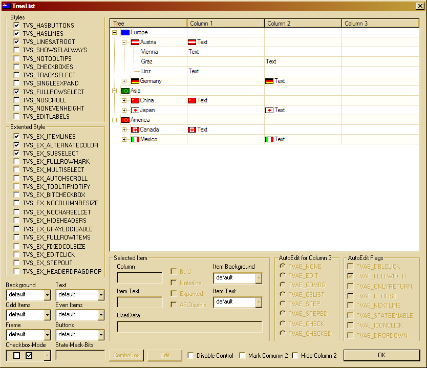
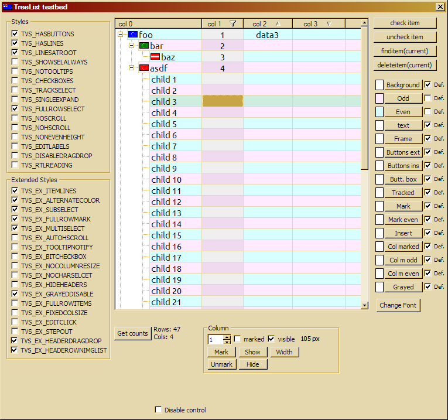

TreeList
========

A combined win32 ListView/TreeView forked from [Anton Zechner's TreeList](http://members.inode.at/anton.zechner/az/TreeList.htm)

Here is a view of the sample application that comes with the original code:
 

I am working to wrap it into a visual control for PowerBuilder and for now my PB sample look like that:

I am also adding some functionnalities, for now:

* the TreeList header can have its own image list instead of sharing it with the tree / list part this can be activated by using the `TVS_EX_HEADEROWNIMGLIST` extended style.
* the control responds to the `WM_GETFONT` message
* when setting a new font via `WM_SETFONT`, we generate an additional bold font from the given font
* the Visual Studio solution can build a standalone dll 

I am also fixing some bugs, as I encounter them. These fixes should be sent back to Mr. Zechner, but I changed somewhat the coding style to my habit and sending a patch would not be so easy...
